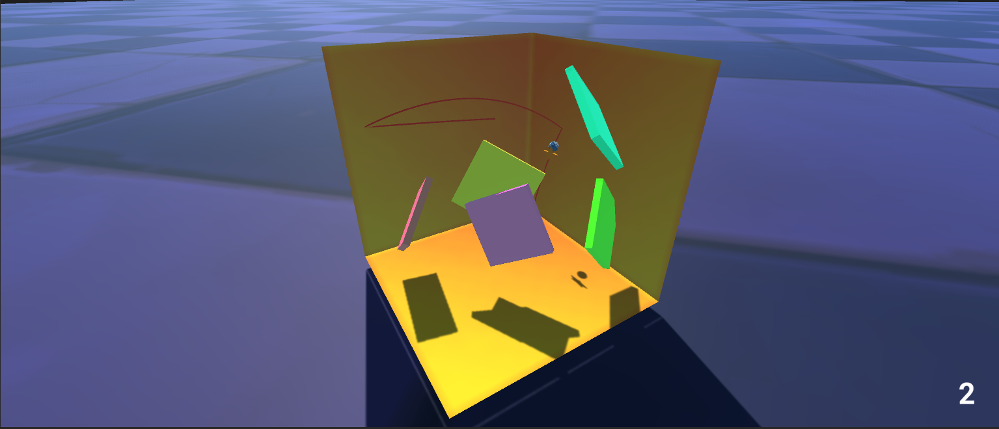

<h1 align="center"> THESIS: SENSING TARGET, OBSTACLE DETECTION, AND OBSTACLE AVOIDANCE IN A 3D SHOOT-AND-TARGET GAME </h1>

The goal is to train an agent which can detect and avoid obstacles inside a polytope. The agent will learn the line of the shot of the ball to reach the goal in optimal steps. Utilizing Tensorflow with Reinforcement learning in Unity alongwith mlagents package to train the game.

#### Step 1:
Create a GUI for the game : Completed

