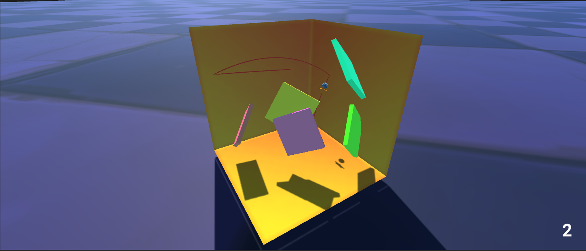

<h1 align="center"> THESIS: Trajectory Prediction Through Deep Reinforcement Learning in Unity </h1>

The thesis was carried out to develop a 3D game that could be used to play. The case of the project was a trajectory prediction shooting game in which the player had to search the goal(star) inside a polytope and shoot the ball to the goal. There were a few obstacles inside the polytope, and they spawn randomly. The player must constantly hit the goal continuously as many as it can. If the player misses the goal, then the game is over. This thesis investigates how artificial intelligence techniques can be used to predict the trajectory of the ball.  

The game contains two main game scenes, one is the Graphic User Interfaces (GUI) scene and another one is the game scene. The first part describes the practicalities of the game. The player could play, control the physics of the ball, get help with the Prediction line, and start or end this game on the GUI scene. 
This thesis presents the, to our knowledge, second part for introducing the vast field of artificial intelligence. Topics introduced include Reinforcement Learning techniques, agent simulation, and Imitation Learning. 

We believe our approach demonstrates the artificial agent that can learn a conditioned trajectory to model human motion inside a polytope using imitation learning.                

#### 1: Trained an agent to learn a conditioned trajectory inside a polytope to reach the goal using nature_cnn visual encoder

#### 2: Developed GUI of the game playable by human and the AI using Generative Adversarial Imitation Learning
